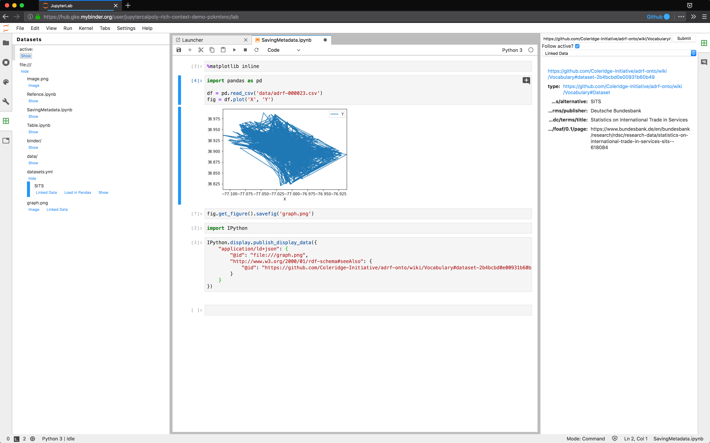

# JupyterLab Metadata Extension

![Stability Experimental][badge-stability]
[![Binder][badge-binder]][binder]

```bash
jupyter labextension install @jupyterlab/metadata-extension @jupyterlab/dataregistry-extension
```

This JupyterLab extension

-   displays linked data about the resources you are interacting with in JuyterLab.
-   enables other extensions to register as linked data providers to expose [JSON LD][json-ld] about an entity given the entity's URL.
-   exposes linked data to the user as a Linked Data viewer in the Data Browser pane.
-   Check out the project vision in the ["Press Release from the Future"](./press_release.md)!



## Contributing

This repository is in active development, and we welcome collaboration. For development guidance, please consult the [development guide](./docs/development.md).

If you have ideas or questions, feel free to open an issue, or, if you feel like getting your hands dirty, feel free to tackle an existing issue by contributing a pull request.

We try to keep the current issues relevant and matched to relevant milestones.

<!-- links -->

[badge-stability]: https://img.shields.io/badge/stability-experimental-red.svg
[badge-binder]: https://mybinder.org/badge_logo.svg
[binder]: https://mybinder.org/v2/gh/jupyterlab/jupyterlab-metadata-service/master?urlpath=lab
[json-ld]: https://json-ld.org/

<!-- /.links -->
