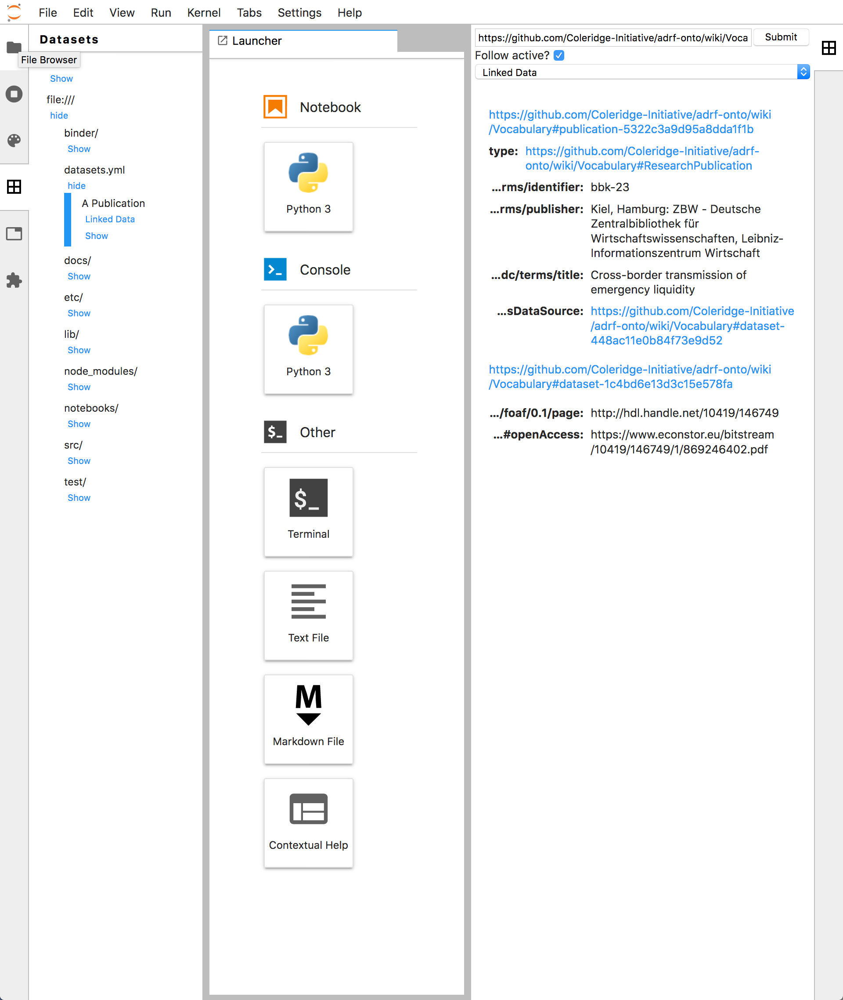
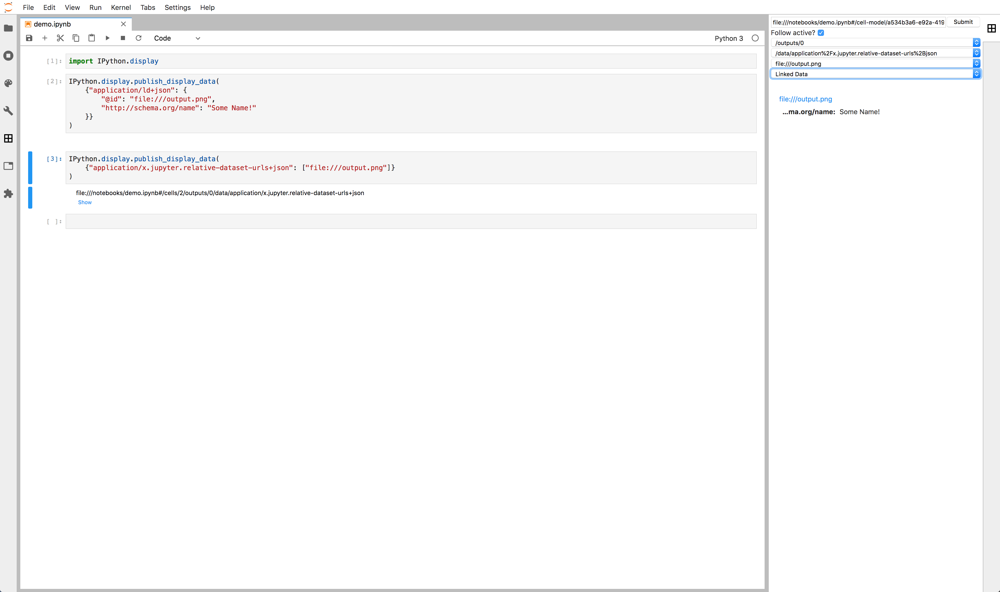

# Usage

The JupyterLab Metadata extension adds a Linked Data viewer to the [Data Registry][data-registry]. To view metadata about a dataset,
find it in the data explorer and then select the "Linked Data" view:

You can also register Linked Data about entities from a notebook by outputting the `application/ld+json` MIME type:

Third party extensions can depend on this extension to expose other linked data providers to register other metadata sources for users.

<!-- links -->

[data-registry]: https://github.com/jupyterlab/jupyterlab-data-explorer

<!-- /.links -->
